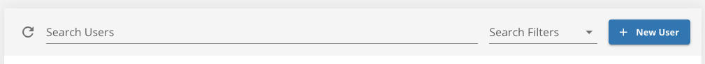
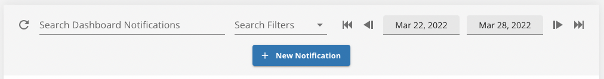
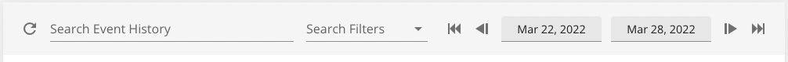

# vue-time-bar
Component for Vue 2 utilizing Vuetify and VueX to consolidate interface elements for searching, filtering and custom actions.

## Requirements

-   Vue 2
-   VueX for state management
-   Vuetify 2
-   [optional] dayjs
-   [optional] axios

## Usage

```html
<template>
    <time-bar
        store="users"
        :filters="headers.filter(x => x.filterable)"
        search-label="Search Users"
        hide-date-range
    >
        <!-- populate action slot, replace routeRelativeURL with your route to an API endpoint for this action -->
        <v-btn
            :to="routeRelativeURL"
            color="secondary"
        >
            <v-icon left> mdi-plus </v-icon>
            New User
        </v-btn>        
    </time-bar>
</template>

<script>
import TimeBar from "TimeBar.vue";

export default {
    components: {
        TimeBar,
    },
}
</script>
```

## Screenshots





